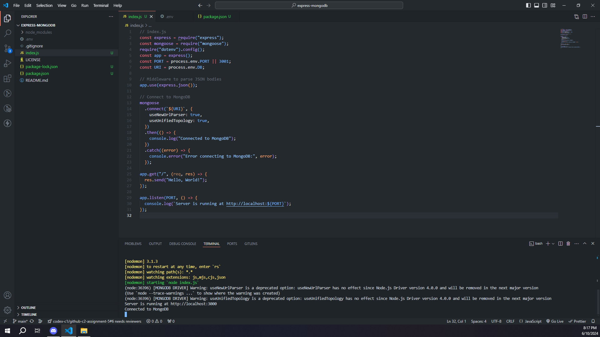
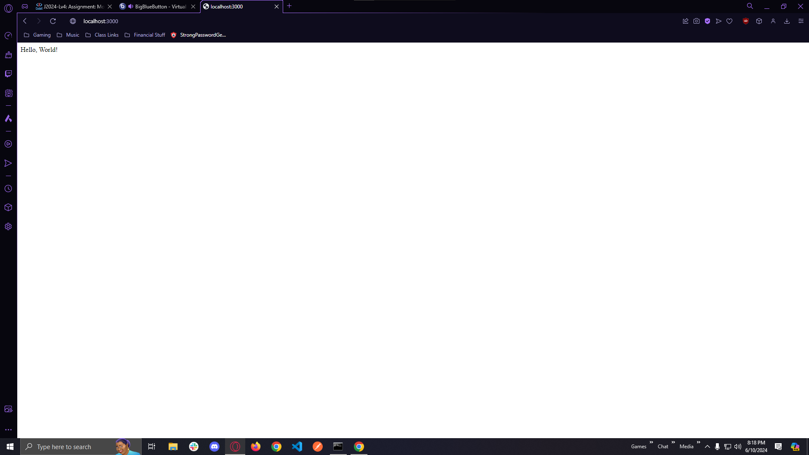

# Objective

Understand MongoDB and its key features.
Set up a MongoDB Atlas account.
Connect to MongoDB from an Express application using Mongoose.

# Instructions
## Part 1: Introduction to MongoDB
### Learn about MongoDB:

MongoDB is a NoSQL database that stores data in flexible, JSON-like documents.

Key features include being document-oriented, schema-less, and highly scalable.

## Part 2: Setting Up MongoDB Atlas
### Create a MongoDB Atlas Account:

Sign up for a free account at MongoDB Atlas.
Create a cluster by selecting the free tier and your preferred cloud provider and region.

### Create a Database User:

Go to "Database Access" and add a new database user with a username and password.

### Whitelist Your IP Address:

Go to "Network Access" and add your current IP address.

### Connect to Your Cluster:

Go to "Clusters", click "Connect", and select "Connect Your Application".
Choose "Node.js" and version "3.6 or later".
Copy the connection string.

## Part 3: Connecting to MongoDB from an Express Application
### Initialize Your Project:

mkdir express-mongodb
cd express-mongodb
npm init -y
npm install express mongoose

### Create the Server:

Create a file named index.js and set up a basic Express server with Mongoose connection.
// index.js
const express = require('express');
const mongoose = require('mongoose');
const app = express();
const port = 3000;

// Middleware to parse JSON bodies
app.use(express.json());

// Connect to MongoDB
mongoose
  .connect('your-mongodb-connection-string-here', {
    useNewUrlParser: true,
    useUnifiedTopology: true,
  })
  .then(() => {
    console.log('Connected to MongoDB');
  })
  .catch((error) => {
    console.error('Error connecting to MongoDB:', error);
  });

app.get('/', (req, res) => {
  res.send('Hello, World!');
});

app.listen(port, () => {
  console.log(`Server is running at http://localhost:${port}`);
});
Test the Connection:

Start your server using Nodemon or node index.js.
Check the console for "Connected to MongoDB".
Navigate to http://localhost:3000/ in your browser to see "Hello, World!".

